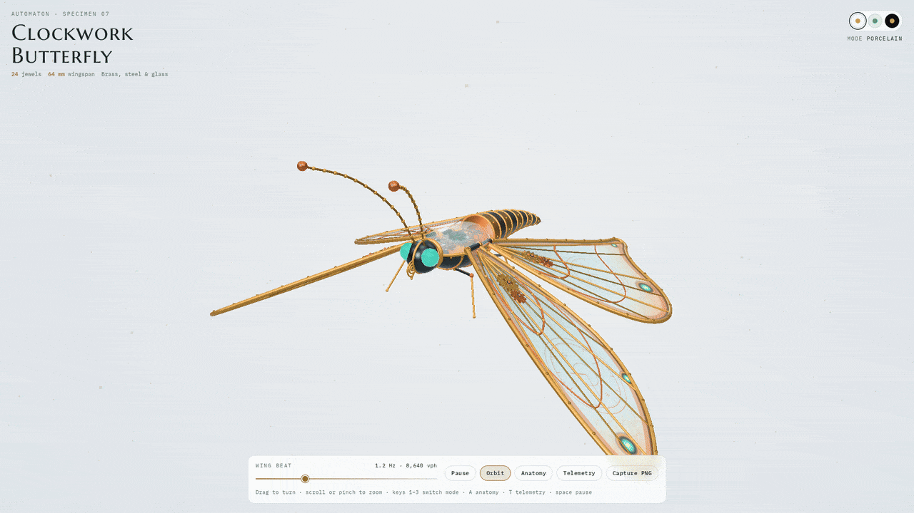
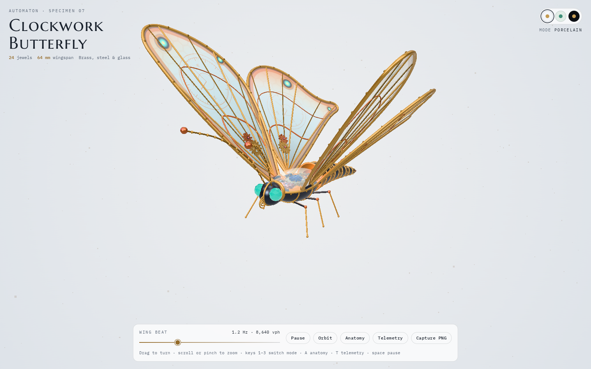
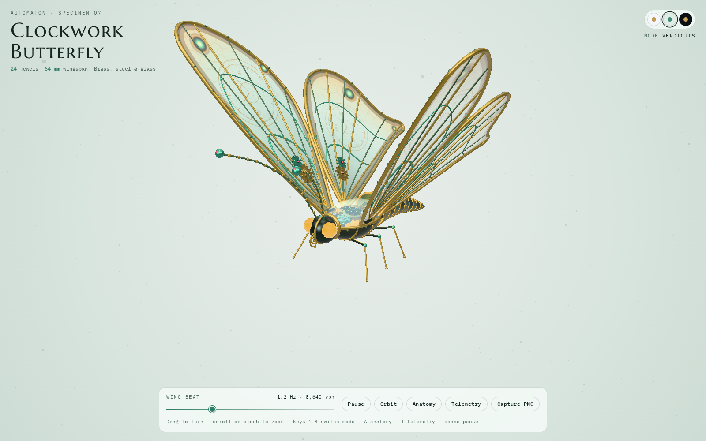
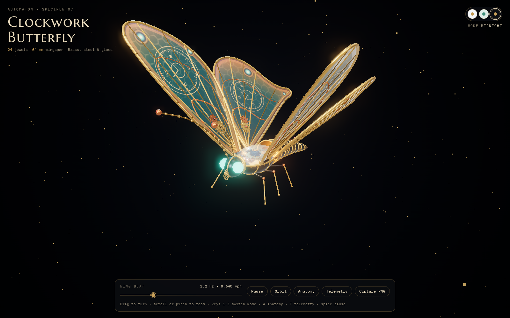
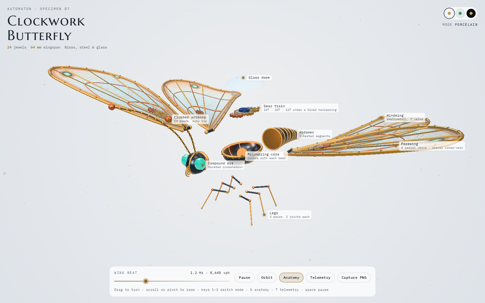
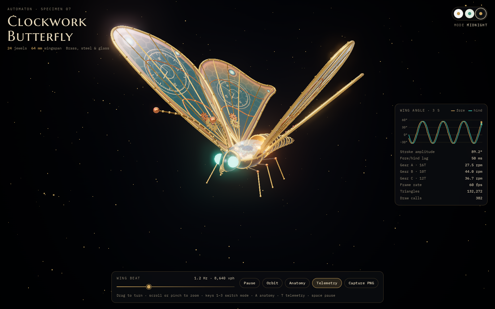
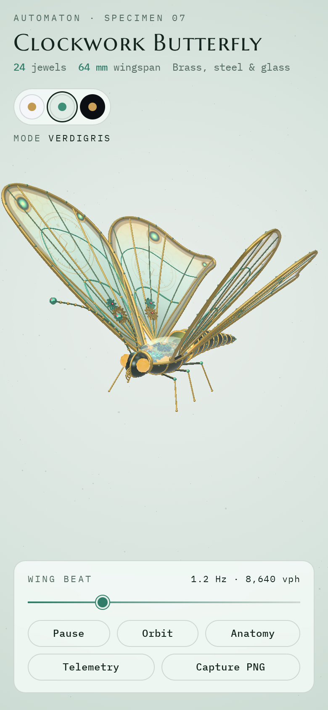

<div align="center">

# 🦋 Clockwork Butterfly

**A mechanical butterfly built entirely from code in three.js: meshing gear trains, glass wings, three aesthetic modes, an exploded anatomy view and live kinematics telemetry.**

[](https://threejs.org)
[](#-run-it-locally)
[](LICENSE)
[](https://YOUR-USERNAME.github.io/clockwork-butterfly/)

[🌐 **Live demo**](https://YOUR-USERNAME.github.io/clockwork-butterfly/) · [✨ Features](#-features) · [⚙️ How it works](#%EF%B8%8F-how-it-works) · [🚀 Run it locally](#-run-it-locally)



🎬 [Watch the full-HD demo (1080p, MP4)](docs/images/demo.mp4)

</div>

<!--
  To show the HD video with an inline player instead of the link above:
  edit this README on github.com, drag docs/images/demo.mp4 into the editor,
  and GitHub replaces it with a https://github.com/user-attachments/... link that plays in place.
-->

## 🎨 Aesthetic modes

Three looks, switchable live with the swatches (top right) or the keys **1–3**. Each mode changes the background, lighting, tone mapping, metal finishes and the painted wing membranes.

| ☀️ Porcelain | 🌿 Verdigris | 🌙 Midnight |
|:---:|:---:|:---:|
|  |  |  |

## ✨ Features

- 🧩 **Fully procedural model.** No 3D files are loaded. Gears, wings, veins, body segments and legs are generated from curves and shapes at runtime (about 130k triangles).
- ⚙️ **Gears that actually mesh.** Teeth are sized from a shared module, spaced by pitch radius, and phase-aligned so a tooth always sits in a gap. Speeds follow the tooth ratios.
- 🎨 **Three aesthetic modes.** Porcelain, Verdigris and Midnight, with a smooth transition and a shareable URL (`#midnight`).
- 🔍 **Anatomy view.** An exploded view pulls the parts apart and labels them: wings, gear train, mainspring core, eyes, antennae, abdomen, legs.
- 📊 **Live telemetry.** A rolling 3-second time series of fore- and hindwing angles, stroke amplitude, the fore/hind phase lag estimated by cross-correlation, gear speeds in rpm, frame rate, triangles and draw calls.
- 🎚️ **Adjustable wing beat.** 0.2–4 Hz, also shown in vph (vibrations per hour, the unit watchmakers use).
- 📸 **PNG capture** of the current view.
- ⚡ **Adaptive quality.** Drops the pixel ratio once if the frame rate stays below 38 fps.
- ♿ **Accessible.** Keyboard shortcuts, visible focus, `prefers-reduced-motion` support, and a layout that works on phones.

| 🔍 Anatomy view | 📊 Telemetry panel | 📱 Mobile |
|:---:|:---:|:---:|
|  |  |  |

## 🧭 Controls

| Input | Action |
|---|---|
| 🖱️ Drag / pinch / scroll | Orbit and zoom |
| `1` · `2` · `3` | Porcelain · Verdigris · Midnight |
| `A` | Toggle anatomy (exploded) view |
| `T` | Toggle telemetry panel |
| `Space` | Pause / resume |
| Wing beat slider | Flapping frequency, 0.2–4 Hz |

🔗 **URL options:** `#midnight` (start mode) · `?anatomy=1` · `?telemetry=1` · `?still=1` (no auto-orbit) · `?ui=0` (hide the interface, for clean captures) · `?manual=1` (frame-by-frame clock used to render the images in this README).

## ⚙️ How it works

### 🔩 Gears
Every spur gear is a `THREE.Shape` with trapezoid teeth, spoke windows cut as holes, then extruded with a bevel. For module `m` and `N` teeth:

- pitch radius `r = N·m / 2`, tip radius `r + m`, root radius `r − 1.25m`
- two gears mesh when their centre distance is `r₁ + r₂`
- angular speed scales by the tooth ratio and reverses: `ω₂ = −ω₁ · N₁ / N₂`
- each driven gear gets a starting phase that puts a gap exactly at the contact point, so teeth interleave instead of overlapping

The thorax train is 16T driving 10T and 12T (module 0.022). Each wing carries its own 14T/12T + 9T pair.

### 🦋 Wing kinematics
Wings are Bézier outlines turned into `ShapeGeometry`. Their membrane is painted on a `<canvas>` (gradient, hexagonal cells, a clock dial, eye spots) and used as colour and emissive maps on an iridescent `MeshPhysicalMaterial`. Veins fan out from the root at even angles and are joined by a discal cross-vein.

The flap angle is a shaped sine with a quicker, stronger downstroke, and the hindwing trails the forewing by 0.35 rad:

```
f(φ) = sin(φ − lag)
θ(φ) = 0.18 + 0.78 · sign(f) · |f|^(0.8 if f > 0 else 1.2)
```

### 📈 Telemetry
At 1.2 Hz the hindwing lag is 0.35 / (2π · 1.2) ≈ 46 ms. The telemetry panel recovers it from the signals alone: it resamples both angles at a fixed 60 Hz into a ring buffer and takes the lag that maximises their cross-correlation within half a beat period. It reads about 50 ms, the true value to within one 16.7 ms sample.

### 💡 Rendering
PBR materials lit by a procedural `RoomEnvironment`, a key and rim light, and a point light inside the mainspring core. Post-processing is `UnrealBloomPass` + `OutputPass`. The light modes use Neutral tone mapping so the pale backgrounds stay clean; Midnight uses ACES for richer highlights.

## 🚀 Run it locally

**Just double-click `index.html`.** It is a single self-contained file (CSS and JS inlined), so it opens straight from your file explorer. An internet connection is needed the first time, because three.js and the fonts load from a CDN.

```bash
git clone https://github.com/YOUR-USERNAME/clockwork-butterfly.git
cd clockwork-butterfly
# then open index.html in your browser
```

### 🛠️ Editing the code
The readable source lives in `src/` (split into modules). After editing, rebuild the root `index.html`:

```bash
python tools/bundle.py
```

To work on `src/` directly, serve it over HTTP, because browsers block ES modules loaded from `file://`:

```bash
cd src
python -m http.server 8000      # open http://localhost:8000
```

## 🌐 Deploy to GitHub Pages

1. Push the repository to GitHub.
2. Open **Settings → Pages**.
3. Under *Build and deployment*, choose **Deploy from a branch**, branch `main`, folder `/ (root)`, then **Save**.
4. After a minute the site is live at `https://YOUR-USERNAME.github.io/clockwork-butterfly/`.

## 📁 Project structure

```
clockwork-butterfly/
├── index.html            ready-to-open build (generated from src/)
├── src/
│   ├── index.html        page markup + import map
│   ├── css/style.css     UI and the three mode palettes (CSS custom properties)
│   └── js/
│       ├── main.js       scene, camera, post-processing, UI, animation loop
│       ├── butterfly.js  procedural geometry: gears, thorax, head, abdomen, legs, wings
│       ├── themes.js     mode definitions + background painter
│       └── telemetry.js  time-series buffer, cross-correlation, sparkline
├── tools/bundle.py       builds index.html from src/
└── docs/
    ├── images/           screenshots, demo GIF and HD video
    └── PUBLISHING.md     GitHub, CV and LinkedIn checklist
```

## 🎯 What this project demonstrates

- 📐 **3D graphics and maths:** procedural geometry, gear-train kinematics, Euler rotation orders, mirrored transforms, projection of 3D anchors to 2D labels.
- 📊 **Signal processing and data visualisation:** fixed-rate resampling, a ring buffer, cross-correlation lag estimation, and a live chart that stays readable in every mode.
- 💻 **Front-end craft:** a token-based theming system, responsive layout, keyboard and reduced-motion support, performance budgeting (draw calls, triangles, adaptive pixel ratio).
- 🔁 **Reproducibility:** a deterministic frame clock (`?manual=1`) that renders the exact images in this README.

## 🗺️ Roadmap

- [ ] Export the telemetry series as CSV
- [ ] Instanced meshes for rivets and beads to cut draw calls
- [ ] A "flight path" mode where the butterfly follows a spline
- [ ] Sound: a soft escapement tick synced to the gear train

## 📄 License

[MIT](LICENSE) © 2026 Yahya Tamouch
